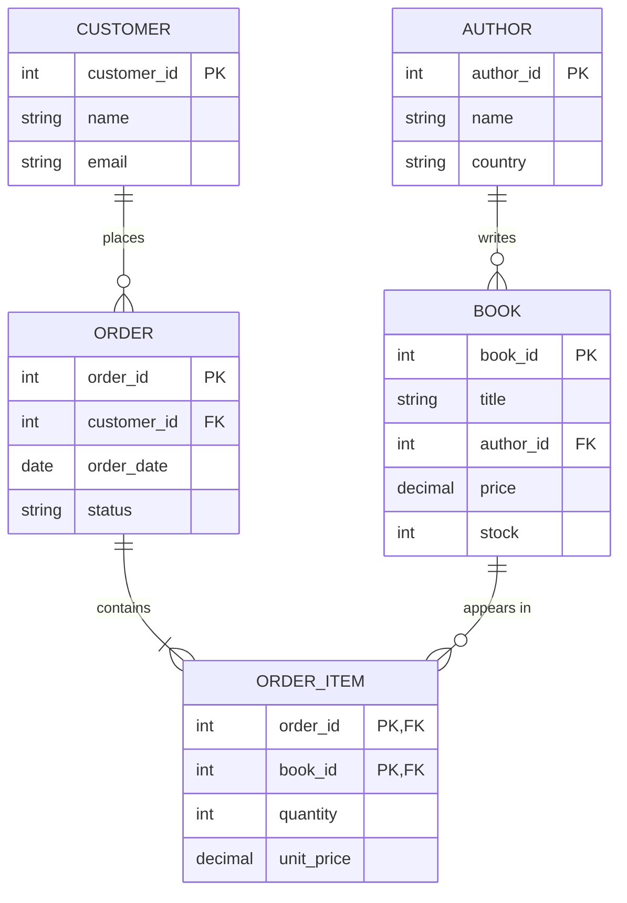

# 3. ER Model & Diagrams

The **Entity-Relationship (ER) model** is a *design* tool: you sketch the real
world as **entities** and **relationships**, then convert the diagram into
relational tables. Almost every DBMS interview and exam asks you to draw or read
an ER diagram.

## Building blocks

### Entities
- **Entity** — a real-world object with independent existence (a Student, a Book).
- **Entity set** — a collection of similar entities (all Students).
- **Strong entity** — has its own key attribute. Drawn as a rectangle.
- **Weak entity** — cannot be uniquely identified by its own attributes alone; it
  depends on a strong (owner) entity and is identified by a **partial key** +
  the owner's key. Drawn as a *double* rectangle; its identifying relationship is
  a *double* diamond. Example: a `Dependent` of an `Employee`.

### Attributes
| Type | Meaning | Notation |
|---|---|---|
| Simple (atomic) | can't be split (age) | oval |
| Composite | splits into parts (name → first, last) | oval with sub-ovals |
| Single-valued | one value (dob) | oval |
| Multivalued | many values (phone numbers) | double oval |
| Derived | computed from others (age from dob) | dashed oval |
| Key | uniquely identifies an entity (roll_no) | underlined |

### Relationships
- **Relationship** — an association between entities ("a Student *enrolls in* a
  Course"). Drawn as a diamond.
- **Degree** — number of entities in the relationship:
  - **Unary/recursive** (1 entity, e.g., Employee *manages* Employee)
  - **Binary** (2 entities — most common)
  - **Ternary** (3 entities)

### Cardinality (mapping constraints)
How many entities on one side relate to the other:
- **One-to-One (1:1)** — one person ↔ one passport.
- **One-to-Many (1:N)** — one author writes many books.
- **Many-to-One (N:1)** — many books belong to one author (same as above, other way).
- **Many-to-Many (M:N)** — a student takes many courses; a course has many students.

### Participation constraints
- **Total participation** — every entity MUST take part (double line). E.g., every
  Loan must belong to a Customer.
- **Partial participation** — participation is optional (single line).

## ER diagram of our bookstore
GitHub renders this Mermaid diagram. `||`, `o{`, etc. show cardinality
(`||` = exactly one, `o{` = zero-or-many).

Read it as: one AUTHOR writes zero-or-many BOOKs; one ORDER contains one-or-many
ORDER_ITEMs; the M:N between ORDER and BOOK is resolved by the **ORDER_ITEM**
junction table (see mapping rule 5 below).

## Converting an ER diagram to tables (mapping rules)
1. **Strong entity → table.** Its attributes become columns; the key becomes the
   primary key.
2. **Weak entity → table** with the owner's PK as a foreign key; PK = (owner PK +
   partial key).
3. **1:1 relationship** → put the PK of one side as a FK (with UNIQUE) in the
   other, or merge both entities into one table.
4. **1:N relationship** → put the PK of the "one" side as a FK on the "many" side.
   (author_id lives on books.)
5. **M:N relationship** → create a **junction/bridge table** whose PK is the pair
   of both entities' PKs (plus any relationship attributes). `order_item` is the
   junction of orders and books, carrying `quantity` and `unit_price`.
6. **Multivalued attribute** → its own table (owner PK + the value).
7. **Composite attribute** → store each leaf part as its own column.
8. **Derived attribute** → usually not stored; computed on read.

## EER (Extended ER)
Adds OOP-style concepts: **generalization** (bottom-up: merge Car and Truck into
Vehicle), **specialization** (top-down: split Employee into Manager, Engineer),
and **aggregation** (treat a whole relationship as one higher-level entity).

### Interview one-liners
- "M:N always becomes a third **junction table**."
- "1:N → foreign key on the many side."
- "Weak entity has no key of its own → needs owner's key + a partial key."
