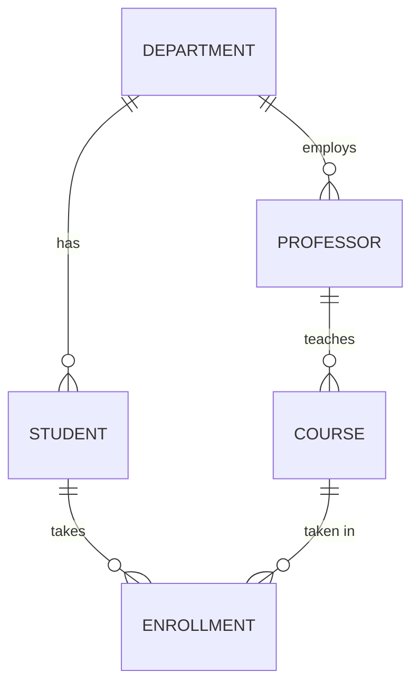

# DBMS word problems (scenario-based practice)

These are the "design / normalize / find the keys / write the query" problems
that show up in exams and interviews. **Try each yourself before opening the
solution** (click the ▸ to expand).

---

## A. ER design

### A1. Design an ER model for a college
> A college has **Departments**. Each department has many **Students** and many
> **Professors**. A student enrolls in many **Courses**; a course is taken by many
> students. Each course is taught by one professor. Model this.

<details><summary>▸ Solution</summary>

Entities: `DEPARTMENT`, `STUDENT`, `PROFESSOR`, `COURSE`.
Relationships & cardinality:
- DEPARTMENT 1—N STUDENT (a student belongs to one dept)
- DEPARTMENT 1—N PROFESSOR
- PROFESSOR 1—N COURSE *teaches* (one prof per course)
- STUDENT M—N COURSE *enrolls* → **junction table** `ENROLLMENT(student_id,
  course_id, grade)`


Tables: STUDENT(**roll** PK, name, dept_id FK), PROFESSOR(**prof_id** PK, name,
dept_id FK), COURSE(**course_id** PK, title, prof_id FK), ENROLLMENT(**(roll,
course_id)** PK, grade), DEPARTMENT(**dept_id** PK, name).
</details>

### A2. Hospital
> A hospital has patients, doctors, and appointments. A patient can see many
> doctors over time; a doctor sees many patients. Each appointment has a date and
> a diagnosis. Model it and list the tables.

<details><summary>▸ Solution</summary>

`PATIENT` M—N `DOCTOR` resolved by `APPOINTMENT` (the junction carries the
relationship attributes):
- PATIENT(**patient_id** PK, name, dob)
- DOCTOR(**doctor_id** PK, name, specialty)
- APPOINTMENT(**appt_id** PK, patient_id FK, doctor_id FK, appt_date, diagnosis)

APPOINTMENT is the M:N bridge; `appt_id` is a surrogate PK (you could also use the
composite `(patient_id, doctor_id, appt_date)`).
</details>

---

## B. Finding keys from functional dependencies

### B1.
> R(A, B, C, D) with FDs: A → B, B → C, C → D. Find the candidate key(s).

<details><summary>▸ Solution</summary>

Compute closures. A⁺ = {A,B,C,D} (A→B→C→D) = all attributes ⇒ **A is a candidate
key**. B⁺ = {B,C,D} (missing A), C⁺ = {C,D}, D⁺={D} — none of B/C/D can determine
A. So the only candidate key is **{A}**. (Note the chain A→B→C→D is transitive ⇒
not in 3NF as one table.)
</details>

### B2.
> R(A, B, C, D) with FDs: AB → C, C → D, D → A. Find a candidate key.

<details><summary>▸ Solution</summary>

Try (AB)⁺ = {A,B,C (from AB→C), D (from C→D)} = {A,B,C,D} = all ⇒ **AB is a
candidate key**. Also (BC)⁺: C→D, D→A gives A, so {B,C,D,A} = all ⇒ **BC** is also
a candidate key. Likewise **BD** (D→A, AB→C). Prime attributes: A, B, C, D all
appear in some candidate key here.
</details>

---

## C. Normalization

### C1. Normalize to 3NF
> `STUDENT(roll, name, course_id, course_name, instructor, instructor_phone)`
> where a course has one instructor. Identify the problems and normalize.

<details><summary>▸ Solution</summary>

Problems (redundancy): course_name, instructor, instructor_phone repeat for every
student in a course; instructor_phone depends on instructor (transitive).

Decompose:
- STUDENT(**roll** PK, name)
- COURSE(**course_id** PK, course_name, instructor_id FK)
- INSTRUCTOR(**instructor_id** PK, instructor_name, instructor_phone)
- ENROLLMENT(**(roll, course_id)** PK) — the M:N link

Now each fact lives in one place → no update/insert/delete anomalies. This is 3NF
(no partial or transitive dependencies).
</details>

### C2. Which normal form?
> `ORDER_ITEM(order_id, product_id, product_name, quantity)`, key
> `(order_id, product_id)`. Which NF is it in, and why?

<details><summary>▸ Solution</summary>

`product_name` depends only on `product_id` — **part** of the composite key ⇒
**partial dependency** ⇒ it's in **1NF but not 2NF**. Fix: move `product_name` to a
PRODUCT(**product_id** PK, product_name) table.
</details>

---

## D. Query scenarios (use the bookstore DB — `schema/`)

### D1.
> Find the customer who has spent the most money overall.

<details><summary>▸ Solution</summary>

```sql
SELECT c.name, SUM(oi.quantity * oi.unit_price) AS total_spent
FROM customers c
JOIN orders o       ON c.customer_id = o.customer_id
JOIN order_items oi ON o.order_id    = oi.order_id
GROUP BY c.customer_id, c.name
ORDER BY total_spent DESC
LIMIT 1;
```
</details>

### D2.
> For each author, how many copies of their books have been sold (across all
> order_items)?

<details><summary>▸ Solution</summary>

```sql
SELECT a.name, COALESCE(SUM(oi.quantity), 0) AS copies_sold
FROM authors a
JOIN books b        ON a.author_id = b.author_id
LEFT JOIN order_items oi ON b.book_id = oi.book_id
GROUP BY a.author_id, a.name
ORDER BY copies_sold DESC;
```
`LEFT JOIN` + `COALESCE` so authors with zero sales still show as 0.
</details>

### D3.
> List books that have never been ordered.

<details><summary>▸ Solution</summary>

```sql
SELECT title FROM books
WHERE book_id NOT IN (SELECT book_id FROM order_items);
```
</details>

---

More to practice: grab any everyday system (library, railway reservation, food
delivery, banking) and (1) draw its ER diagram, (2) map it to tables, (3) list the
keys, (4) normalize to 3NF, (5) write 3 useful queries. That five-step drill is
exactly what interviews test.
